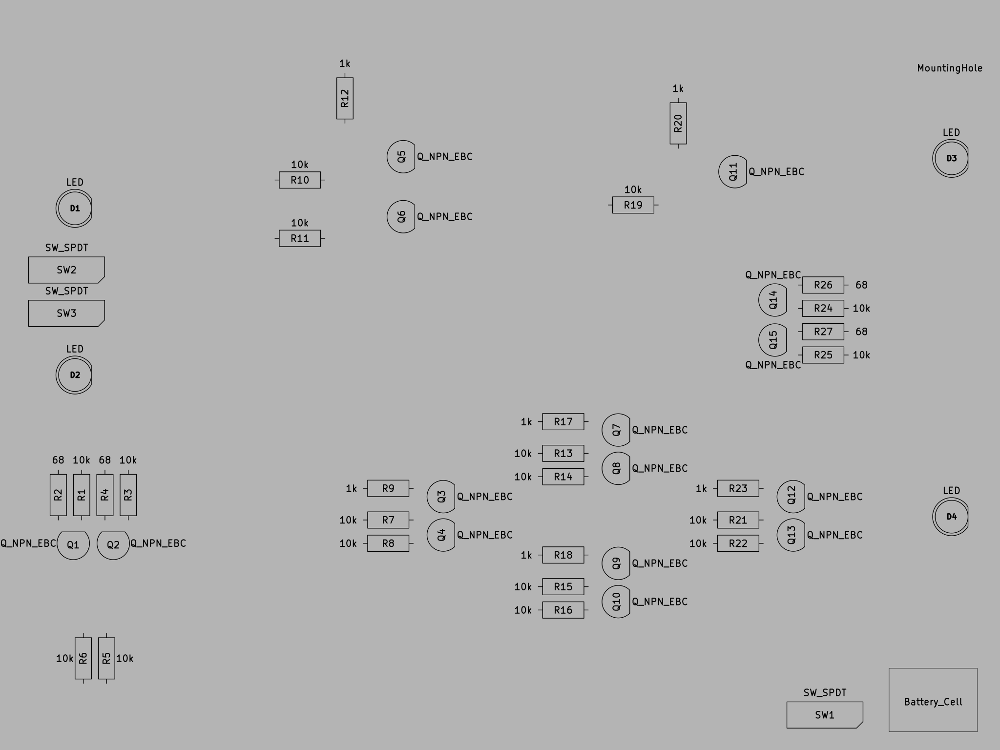
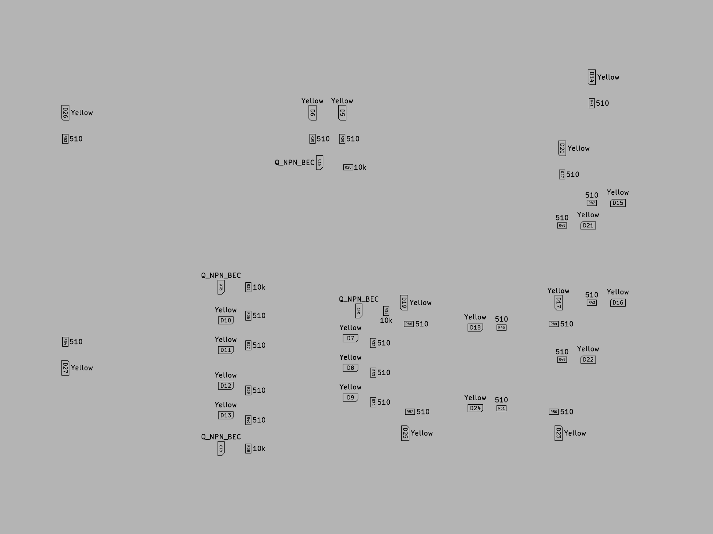

# RTL Half Adder Circuit

A half adder circuit implemented with resistor transistor logic. All essential logic is on the front with through hole parts, and additional lights are surface mount on the back.

# Schematic

# BOM

# Component Placement

# LICENSE

This work is licensed under a [Creative Commons Attribution-NonCommercial-ShareAlike 4.0 International License](http://creativecommons.org/licenses/by-nc-sa/4.0/).
