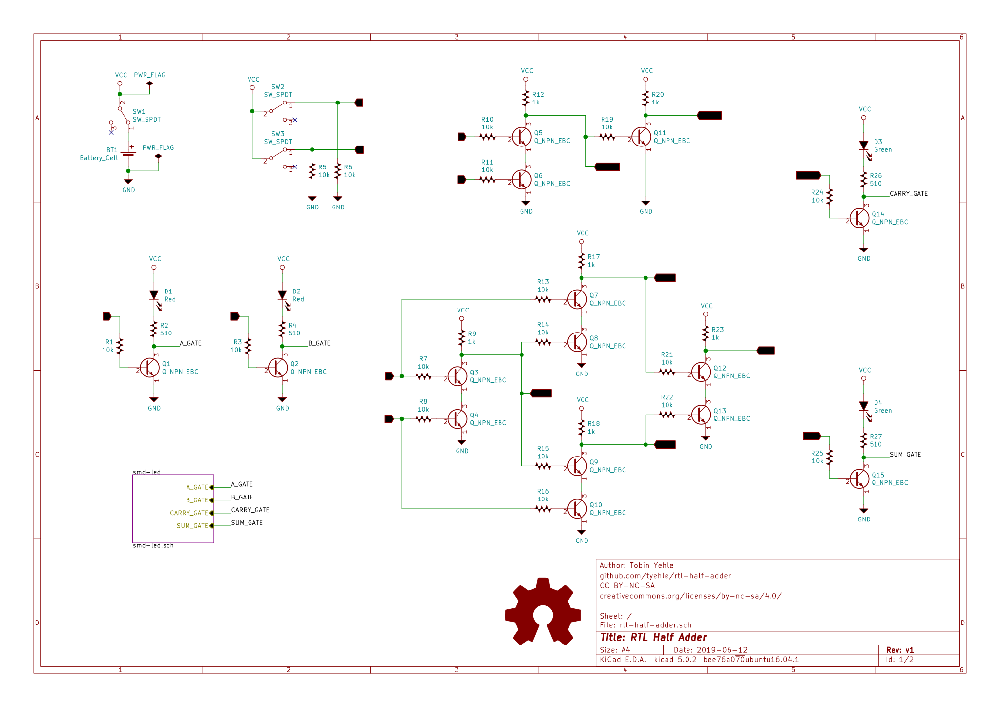
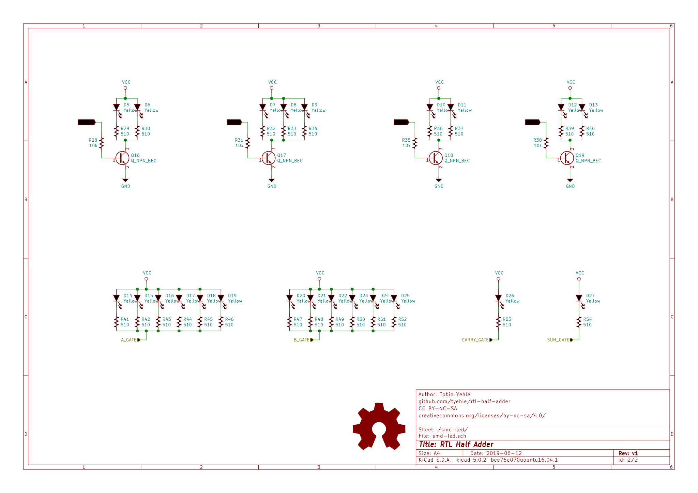

# RTL Half Adder Circuit

A half adder circuit implemented with resistor transistor logic. All essential logic is on the front with through hole parts, and additional lights are surface mount on the back.

# Schematic

# BOM

| Reference                                                                                   | Value        | Part Number       | Quantity | Datasheet                                                                                                  | Link                                                                    |
|---------------------------------------------------------------------------------------------|--------------|-------------------|----------|------------------------------------------------------------------------------------------------------------|-------------------------------------------------------------------------|
| BT1                                                                                         | Battery_Cell | BAT-HLD-012-THM   | 1        | [Datasheet](https://linxtechnologies.com/wp/wp-content/uploads/bat-hld-012-thm.pdf)                        | [mouser.com](https://www.mouser.com/ProductDetail/BAT-HLD-012-THM)      |
| D1 D2                                                                                       | Red          | LTL-4223          | 2        | [Datasheet](https://optoelectronics.liteon.com/upload/download/DS20-2003-313/LTL-4223-032A.pdf)            | [mouser.com](https://www.mouser.com/ProductDetail/LTL-4223)             |
| D3 D4                                                                                       | Green        | LTL-4233          | 2        | [Datasheet](https://optoelectronics.liteon.com/upload/download/DS-20-92-1097/4233DG.pdf)                   | [mouser.com](https://www.mouser.com/ProductDetail/LTL-4233)             |
| D10 D11 D12 D13 D14 D15 D16 D17 D18 D19 D20 D21 D22 D23 D24 D25 D26 D27 D5 D6 D7 D8 D9      | Yellow       | LTST-C230KSKT     | 23       | [Datasheet](https://optoelectronics.liteon.com/upload/download/DS22-2000-254/LTST-C230KSKT.pdf)            | [mouser.com](https://www.mouser.com/ProductDetail/859-LTST-C230KSKT)    |
| Q16 Q17 Q18 Q19                                                                             | Q_NPN_BEC    | MMBT3904,215      | 4        | [Datasheet](https://assets.nexperia.com/documents/data-sheet/MMBT3904.pdf)                                 | [mouser.com](https://www.mouser.com/ProductDetail/MMBT3904215)          |
| Q1 Q10 Q11 Q12 Q13 Q14 Q15 Q2 Q3 Q4 Q5 Q6 Q7 Q8 Q9                                          | Q_NPN_EBC    | 2N3904BU          | 15       | [Datasheet](https://www.onsemi.com/pub/Collateral/2N3904-D.pdf)                                            | [mouser.com](https://www.mouser.com/ProductDetail/2N3904BU)             |
| R2 R26 R27 R4                                                                               | 510          | CFR-25JR-52-510R  | 4        | [Datasheet](http://www.yageo.com/NewPortal/yageodocoutput?fileName=/pdf/throughhole/Yageo_LR_CFR_2013.pdf) | [mouser.com](https://www.mouser.com/ProductDetail/CFR-25JR-52-510R)     |
| R28 R31 R35 R38                                                                             | 10k          | CR0805-FX-1002ELF | 4        | [Datasheet](https://www.bourns.com/pdfs/chpreztr.pdf)                                                      | [mouser.com](https://www.mouser.com/ProductDetail/652-CR0805FX-1002ELF) |
| R29 R30 R32 R33 R34 R36 R37 R39 R40 R41 R42 R43 R44 R45 R46 R47 R48 R49 R50 R51 R52 R53 R54 | 510          | CR0805-FX-5100ELF | 23       | [Datasheet](https://www.bourns.com/pdfs/chpreztr.pdf)                                                      | [mouser.com](https://www.mouser.com/ProductDetail/652-CR0805FX-5100ELF) |
| R1 R10 R11 R13 R14 R15 R16 R19 R21 R22 R24 R25 R3 R5 R6 R7 R8                               | 10k          | CFR-25JT-52-10K   | 17       | [Datasheet](http://www.yageo.com/NewPortal/yageodocoutput?fileName=/pdf/throughhole/Yageo_LR_CFR_2013.pdf) | [mouser.com](https://www.mouser.com/ProductDetail/CFR-25JT-52-10K)      |
| R12 R17 R18 R20 R23 R9                                                                      | 1k           | CFR-25JT-52-1K    | 6        | [Datasheet](http://www.yageo.com/NewPortal/yageodocoutput?fileName=/pdf/throughhole/Yageo_LR_CFR_2013.pdf) | [mouser.com](https://www.mouser.com/ProductDetail/CFR-25JT-52-1K)       |
| SW1 SW2 SW3                                                                                 | SW_SPDT      | EG1218            | 3        | [Datasheet](https://www.e-switch.com/system/asset/product_line/data_sheet/119/EG.pdf)                      | [mouser.com](https://www.mouser.com/ProductDetail/EG1218)               |

# Assembly notes
[PDF](docs/rtl-half-adder-assembly.pdf)

# LICENSE

This work is licensed under a [Creative Commons Attribution-NonCommercial-ShareAlike 4.0 International License](http://creativecommons.org/licenses/by-nc-sa/4.0/).
